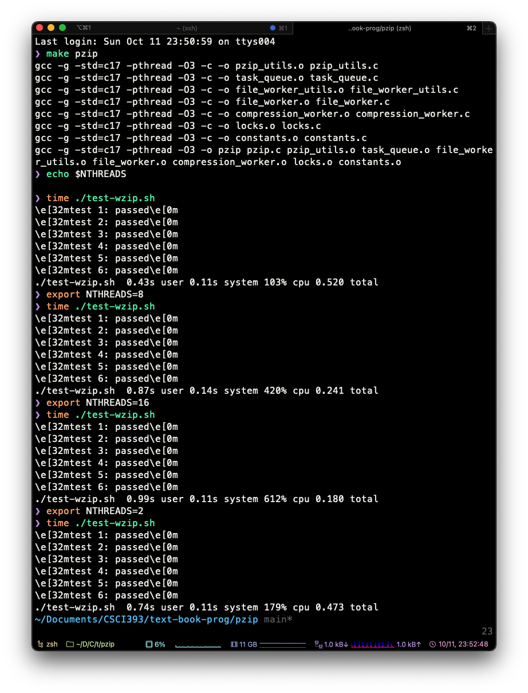

I used one thread for read file info, one thread for write output to stdout, and NTHREADS threads to write compression. The speed up is somewhat significant. In my test (see the screenshot below), the ./test-wzip.sh runs from 0.520 to 0.180 with 1 thread and 16 threads respectively. I tried to compile and run the same program on my linux machien, but it gives segmentation fault for some reason. Valgrind doesn't give me any useful information so I don't know how to fix it. In my limited testing, I am not sure if there is any race conditions. 

