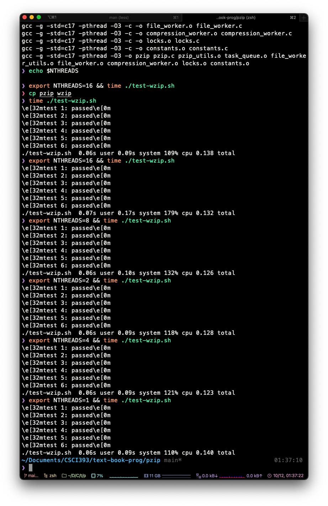

Update: 
Minor changes to the content between the locks. The following test is run on my computer with 8 cores and 16 from hyperthreading (not sure if the description is correct). 

```text
❯ time ./pzip ./tests/6.in > a.o
./pzip ./tests/6.in > a.o  0.02s user 0.03s system 31% cpu 0.167 total
❯ echo $NTHREADS
1
❯ export NTHREADS=16
❯ time ./pzip ./tests/6.in > a.o
./pzip ./tests/6.in > a.o  0.03s user 0.10s system 571% cpu 0.022 total
❯ export NTHREADS=8
❯ time ./pzip ./tests/6.in > a.o
./pzip ./tests/6.in > a.o  0.03s user 0.04s system 414% cpu 0.016 total
``` 

Update: 
The 6.in runs with 4 threads twice as fast as that with 1 thread. I got 0.027 and 0.056 respectively. 


Usage (PLEASE NOTE IT'S `pzip` NOT `wzip`)

```shell
make pzip
cp pzip wzip
./test-wzip.sh
export NTHREADS=4 && time ./test-wzip.sh
```


I used one thread for reading file info, one thread for writing output to stdout, and NTHREADS threads to write compression. The speed up is somewhat significant. In my test (see the screenshot below), the ./test-wzip.sh runs from 0.140 to 0.123 with 1 thread and 4 threads respectively. I tried to compile and run the same program on my linux machine, but it gives segmentation fault for some reason. Valgrind doesn't give me any useful information so I don't know how to fix it. In my limited testing, I am not sure if there is any race conditions. 


